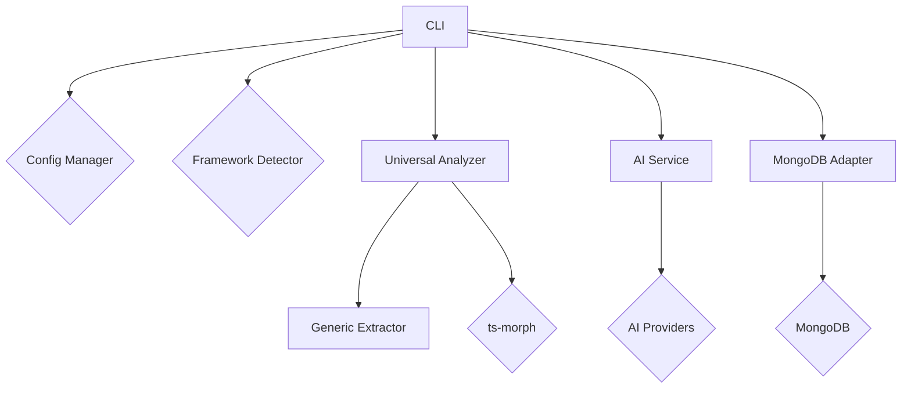

# Architecture

Better Docs is designed with a modular architecture that allows for easy extension and customization. The core components are:

-   **CLI (`cli.ts`)**: The command-line interface is the main entry point for the application. It uses the `commander` library to define and handle commands.

-   **Config Manager (`config.ts`)**: The `ConfigManager` is responsible for loading and managing the configuration from environment variables and the `betterdocs.config.json` file.

-   **Framework Detector (`framework-detector.ts`)**: This component detects the TypeScript framework used in the project (e.g., Express, NestJS).

-   **Universal Analyzer (`universal-analyzer.ts`)**: The `UniversalAnalyzer` is the core of the analysis process. It uses the `ts-morph` library to parse the TypeScript code and extract information about routes, controllers, services, and types.

-   **Extractors (`extractors/`)**: Extractors are responsible for extracting framework-specific information from the source code. The `GenericExtractor` provides a baseline for all frameworks.

-   **AI Service (`ai-service.ts`)**: The `AIService` interacts with AI providers (Google, OpenAI, Anthropic) to generate documentation from the analysis data.

-   **MongoDB Adapter (`mongodb-adapter.ts`)**: This adapter provides a way to store and retrieve analysis data and generated documentation in a MongoDB database.

## Architecture Diagram

